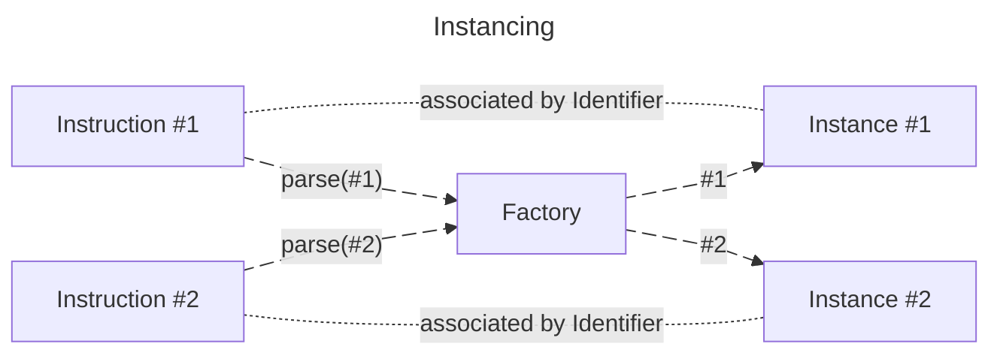
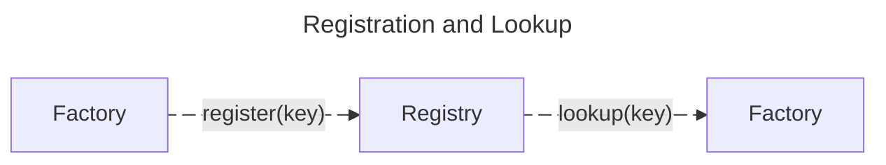
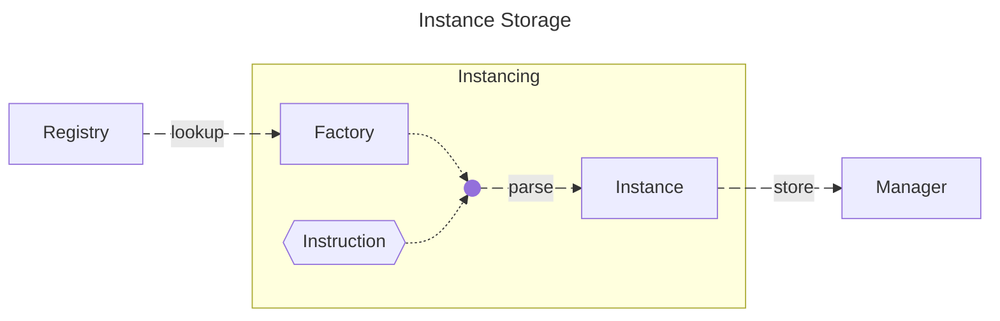
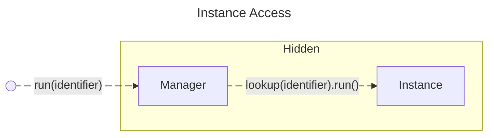

@snippet:api-state:unfinished@

# Overview

This page intends to give an elaborate overall introduction to the API and all its basic concepts.

<div class="grid" markdown>

!!! abstract "What this page covers"
    - [How the API is structured](#api-structure)
    - [What basic concepts are used in the API](#api-concepts)

!!! info "What this page does not cover"
    - What an API is
    - How an implementation example might look like
    - [How to obtain the API](../Obtaining-API.md)
    - [How to integrate the API into your project](../Overview.md)
    
</div>

## API Structure

The API is structured to be intuitive to navigate and grants you access to all its features with short stream-like paths 
while retaining the ability to inject parts into your own classes to comply with the [Law of Demeter](https://en.wikipedia.org/wiki/Law_of_Demeter).  
The tree-like capsulation of features ensures a narrowing scope as you move down the path.

<div class="grid" markdown style="grid-template-columns: 2fr 1fr;">
!!! abstract "Chart"
    === "Step 1"
        ```mermaid
        ---
        title: Obtain BetonQuestApi
        ---
        flowchart LR
            Service("BetonQuestApiService")
            API@{ shape: procs, label: "BetonQuestApi"}
            Service target@--> API
            target@{ animate: true }
        ```
    === "Step 2"
        ```mermaid
        ---
        title: Access BetonQuestApi Features
        ---
        flowchart LR   
            API@{ shape: procs, label: "BetonQuestApi"}
            subgraph two [Features]
                direction LR
                profiles("profiles()")
                loggerFactory("loggerFactory()")
                actions("actions()")
                more@{ shape: procs, label: "and more..."}
            end
            API --> profiles
            API --> loggerFactory
            API target@--> actions
            API --> more
            target@{ animate: true }
        ```
    === "Step 3"
        ```mermaid
        ---
        title: Access Feature Details
        ---
        flowchart LR
            actions("actions()") 
            subgraph three [Feature Details]
                    direction LR
                    manager("manager()")
                    registry("registry()")
            end
            actions target@--> manager
            actions --> registry
            target@{ animate: true }
        ```
    === "Full"
        ```mermaid
        ---
        title: Overview
        ---
        flowchart LR
            Service("BetonQuestApiService")
            subgraph one [API]
                direction LR
                API@{ shape: procs, label: "BetonQuestApi"}
            subgraph two [Features]
                direction LR
                profiles("profiles()")
                loggerFactory("loggerFactory()")
                actions("actions()")
                more@{ shape: procs, label: "and more..."}
                
                subgraph three [Feature Details]
                        direction LR
                        manager("manager()")
                        registry("registry()")
                end
                actions target3@--> manager
                actions --> registry
                
            end
            API --> profiles
            API --> loggerFactory
            API target2@--> actions
            API --> more
            end
            Service target1@--> API
            target1@{ animate: true }
            target2@{ animate: true }
            target3@{ animate: true }
        ```


!!! info "Explanation"
    === "Step 1"
        On the previous page, we learned [how to obtain the API](../Obtaining-API.md).  
        <br>The highlighted step is equivalent to ``betonQuestApiService.api(yourPlugin)``
    === "Step 2"
        Once the API is obtained, we can access the features of the API.
        Among these features are the `profiles()`, `loggerFactory()`, `actions()` and many more.  
        <br>They are partially discussed in more detail in the [concepts section](#api-concepts) below.  
        Some features have their own pages, which are linked in the sidebar by their name.  
        <br>The highlighted step is equivalent to ``betonQuestApi.actions()``
    === "Step 3"
        Some features have their own sub-features that essentially split up the feature into smaller parts.
        Most factory-type features have a `manager()` and a `registry()` sub-feature.
        Learn more about how BetonQuest uses factories in the [concepts section](#factories-registries-managers) below.  
        <br>The highlighted step is equivalent to ``actions.manager()``
    === "Full"
        The API is structured in a way that it is easy to navigate and therefore allowing you to access all features 
        with short paths while retaining the ability to inject parts into your own classes to comply with the Law of 
        Demeter.  
        <br>The highlighted steps are equivalent to ``betonQuestApiService.api(yourPlugin).actions().manager()``

</div>

## API Concepts

The following sections will give you a more in-depth overview of the API's concepts and ideas.
This section is _not necessary_ to use the API, but it will help you _understand_ the API's structure and how it works.

### Identifiers

An identifier refers to a specific element in a quest package, consisting of the path to the containing package and the element's name.

Unlike [identifiers used in packages](../../Documentation/Scripting/Packages-&-Templates.md#working-across-packages), 
API identifiers always contain the full absolute package path (no relative context exists) and are always type-specific.
An `ActionIdentifier` may have the same string representation as an `ObjectiveIdentifier`, but they refer to different types and cannot be used interchangeably.
This type safety prevents accidentally passing an action identifier where a condition identifier is expected, providing compile-time validation.

Identifiers serve as the primary mechanism for locating and executing quest components at runtime. 
The corresponding [manager](#manager) performs a lookup to retrieve the instance created during quest package loading. 
This relationship maintains consistency across server restarts and quest package reloads, 
as the same identifier always resolves to functionally identical instances when recreated from the same [instruction](../Tools/Instruction.md).

To obtain a new identifier instance without parsing it from an instruction, you can resolve it directly through the API.
Note that direct identifier resolution is only possible when the package is loaded and contains the referenced object.

??? example "Code Example"
    The following example demonstrates how to obtain an `ActionIdentifier` for the action `openGate` in the package `daily`.
    ```java
    final QuestPackage questPackage = betonQuestApi.packages().getPackage("daily");
    final ActionIdentifier actionId = betonQuestApi.identifiers().getFactory(ActionIdentifier.class)
        .parseIdentifier(questPackage, "openGate"); //(1)!
    ```
    
    1. The `questPackage` is nullable. If it is null, the string has to contain the absolute package path. If it is 
    not null, the string can be relative to the package's path.

### Factories, Registries, Managers

The [factory design pattern](https://refactoring.guru/design-patterns/abstract-factory){:target="_blank"} is used in the API to create objects without having to know their concrete classes.
In BetonQuest, this concept is further enhanced by [instructions](../Tools/Instruction.md) for configurability and to ensure that identical objects can be recreated consistently.
Each instruction defines how to create a specific instance, and the factory uses this instruction to produce the actual object.
This allows BetonQuest to reload quest packages and recreate identical object instances from the same instructions, maintaining consistency across server restarts.

The following explanation uses `object` as a placeholder, since the concepts apply to actions, conditions, objectives, and other 
factory-based features throughout the API.

To create a new `object`, four components are required in the process:

1. **Implementation** – The concrete `object` class that performs the actual game logic
2. **Factory** – Creates instances of the `object` from instructions and validates its parameters
3. **Registry** – Stores and looks up `object` factories by their type key (e.g., `block`, `give`, `notify`)
4. **Manager** – Maintains created `object` instances, accessible by their identifier for execution during server runtime

#### Implementation & Factory

During BetonQuest's loading phase, an `object` instance is created _for each_ instruction found in the quest package.
Each factory is identified by the instruction's first element (its type key) and is responsible for creating an `object` instance from that instruction.

The factory performs several critical tasks:

- **Parsing**: Extracts and validates all parameters from the instruction string
- **Validation**: Ensures all required parameters are present and correctly formatted
- **Instantiation**: Creates the concrete `object` implementation with the parsed configuration
- **Error handling**: Provides clear error messages if the instruction is malformed (mostly abstracting away by the [instruction](../Tools/Instruction.md) implementation)

The instruction's identifier is associated with the created `object` instance, establishing a bidirectional relationship.
When an `object` needs to be invoked — whether by an action, an objective, or any other component — the identifier is used to 
locate and execute the correct `object` instance from the manager.

This separation between factory (creation logic) and implementation (execution logic) allows for clean code organization
and makes it easier to add new `object` types without modifying existing code.




#### Registry

A registry functions as a structured map that maintains associations between instruction type keys and their corresponding **factories**.
Each registry is type-specific: the `object` registry maintains all available `object` factories, the condition registry maintains all condition factories, etc.

The registry serves as the central lookup mechanism for factories:

- **Registration**: Plugins register their custom `object` factories with unique type keys during initialization and pre-package loading
- **Lookup**: During quest package loading, BetonQuest queries the registry using the instruction's type key to find the appropriate factory
- **Validation**: The registry can validate that a requested factory exists before attempting to create instances

To introduce a new `object` type, its factory must be registered with the `object` registry using a unique type key.
During BetonQuest's loading phase, the system queries the registry to locate the appropriate factory for each instruction type, 
instantiates the corresponding objects, and stores these instances in the manager for later retrieval and execution.

The registry pattern ensures loose coupling between the core system and individual `object` implementations, allowing BetonQuest
to support both built-in and plugin-provided `object`s through the same unified interface.



#### Manager

A manager is essentially a map of known **instances** for each identifier grouped by a certain type of instruction.
All active and loaded instances are stored in the manager, providing runtime access to them.

The manager's responsibilities include:

- **Storage**: Maintains a collection of all created instances
- **Retrieval**: Provides fast lookup of instances by identifier
- **Lifecycle**: Manages the lifecycle of instances, handling cleanup when quest packages are reloaded

When a quest package is loaded, the manager is populated with instances created by factories. 
When a quest package is unloaded or reloaded, the manager removes all associated instances to prevent memory leaks
and ensure the new versions are used.



Hence, to run, for example, an action using its identifier, the manager will be able to find the correct action 
instance and execute it.



---

<div class="grid" markdown style="text-align: center;">
<div markdown style="text-align: left;">
[:octicons-arrow-left-16: Obtain the API](../Obtaining-API.md){ .md-button .md-button--primary }
</div>
<div markdown style="text-align: right;">
[Learn about Instructions :octicons-arrow-right-16:](../Tools/Instruction.md){ .md-button .md-button--primary }
</div>
</div>
