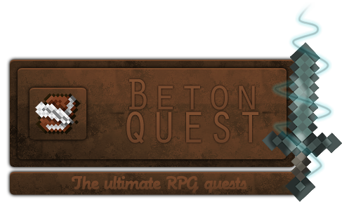

BetonQuest is an advanced and powerful quests plugin. It offers RPG-style conversations with NPCs and a very flexible quest system. Instead of being limited to creating "quest" objects with taking requirements and rewards upon completion, BetonQuest allows you to freely define what should happen (events), if it should happen (conditions) and what needs to be done for it to happen (objectives). The quests do not have to be like "kill, bring, get reward". Multi-threaded stories can be created, narrated with NPC conversations, and with multiple endings that affect a player's gameplay differently. 
If you want to go completly crazy you can use BetonQuest for much more then quests. For some it is a backbone of their server. This is possible because BetonQuest has support for many plugins.

## Features

* Minecraft **1.8**, **1.9**, **1.10**, **1.11**, **1.12**, **1.13**, **1.14**, **1.15** support
* **Multiple choice conversations** with NPCs using an inventory GUI
* **Many ways of displaying your NPCs conversations**: Customisation is possible
* **Powerful event system**: anything can happen anywhere in a quest
* Even more **powerful condition system**: limit whenever something should (or should not) happen
* **Journal** in a book
* **Backpack** for quest items
* Advanced item handling which considers even text in books
* **Party system** allows creation of group quests
* Ability to create various **reputation systems** (points)
* Fire events for a players when they enter a specified area (global locations)
* **Daily quests** or repeatable reward collection (`delay` objective)
* Variables in conversations - let the NPC tell the player how much more wood he needs!
* Quests can be organized into distributable packages
* **Citizens2** NPC support
* Integrated with:
    * [BountifulAPI](https://www.spigotmc.org/resources/bountifulapi-1-8-1-13.1394/)
    * [BetonLangAPI](https://github.com/Co0sh/BetonLangAPI)
    * [Citizens](https://dev.bukkit.org/bukkit-plugins/citizens/)
    * [Denizen](https://dev.bukkit.org/bukkit-plugins/denizen/)
    * [EffectLib](https://dev.bukkit.org/bukkit-plugins/effectlib/)
    * [Heroes](https://dev.bukkit.org/bukkit-plugins/heroes/)
    * [HolographicDisplays](https://dev.bukkit.org/bukkit-plugins/holographic-displays/)
    * [LegendQuest](https://dev.bukkit.org/bukkit-plugins/legendquest/)
    * [Magic](https://dev.bukkit.org/bukkit-plugins/magic/)
    * [McMMO](https://dev.bukkit.org/bukkit-plugins/mcmmo/)
    * [MythicMobs](https://dev.bukkit.org/bukkit-plugins/mythicmobs/)
    * [PlaceholderAPI](https://www.spigotmc.org/resources/placeholderapi.6245/)
    * [PlayerPoints](https://dev.bukkit.org/bukkit-plugins/playerpoints/)
    * [ProtocolLib](https://www.spigotmc.org/resources/protocollib.1997/)
    * [Quests](https://dev.bukkit.org/bukkit-plugins/quests/)
    * [RacesAndClasses](https://dev.bukkit.org/bukkit-plugins/racesandclasses/)
    * [Shopkeepers](https://dev.bukkit.org/bukkit-plugins/shopkeepers/)
    * [SkillAPI](https://dev.bukkit.org/bukkit-plugins/skillapi/)
    * [Skript](https://dev.bukkit.org/bukkit-plugins/skript/)
    * [Vault](https://dev.bukkit.org/bukkit-plugins/vault/)
    * [WorldEdit](https://dev.bukkit.org/bukkit-plugins/worldedit/)
    * [WorldGuard](https://dev.bukkit.org/bukkit-plugins/worldguard/)
* Multiple languages with easy translating
* An API for creating personal events, conditions and objectives
* SQLite and **MySQL** support
* Last but not least, an **active, open source** project with development builds available

## Overview

Imagine you are having a conversation with an NPC. Choose from the multiple options, and the NPC will react differently. For example, when asked for a job, he will tell you to cut some trees. If you accept his offer, an event will be fired. It will start an objective for getting wood. It will also "tag" you as someone who started the quest. From now on, the NPC will check for that tag and have different options in the conversation, such as telling the player to hurry up.

When you complete the objective, the objective will fire another event. This one will "tag" you as someone who has collected the wood. When you go back to the NPC and interact with him, he will check (using a condition) if you have all the required wood in your inventory. If so, he will fire another event, giving you the reward.

There is no single "quest" object. This is only a conversation which consists of firing events and checking conditions. The objective also was not a "quest" - it only added a tag when you collected the wood. It could not exist on its own. The same conversation, on the other hand, could start some other quests afterwards (such as mining ores), so it is also not a "quest".

Do not be disappointed by the examples of getting wood and mining ore. These were only simplifications, so it is easier to explain the system. BetonQuest is capable of much more. You can add entries to a player's journal based on the quests he is doing. For example, in Morrowind, the conversations can be as multi-threaded as in Baldur's Gate, and quests can be started by entering specific location similar to within Skyrim. You can create reputation systems, unique quest items, books that react to being read, and so on. Your quests can have multiple paths to reach different endings depending on the players' decisions, and they can also require multiple players to complete an objective.

As mentioned before, you do not have to use BetonQuest for quests only. Conversations with NPCs can also help your players, teleports them around the map, describe server features, buy or sell stuff, give ranks etc. The only limit is your imagination!
